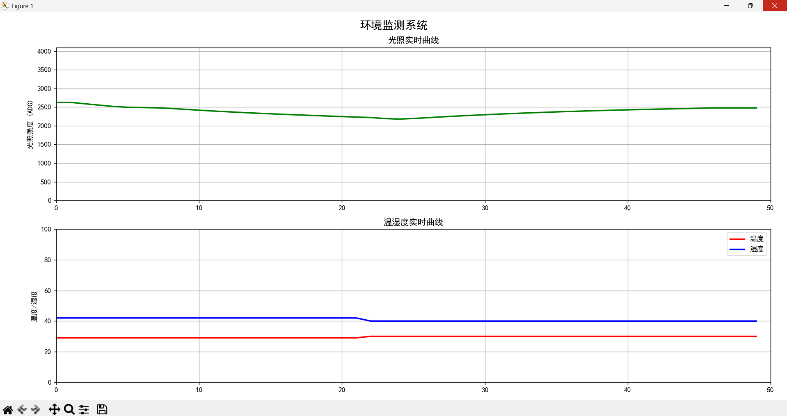
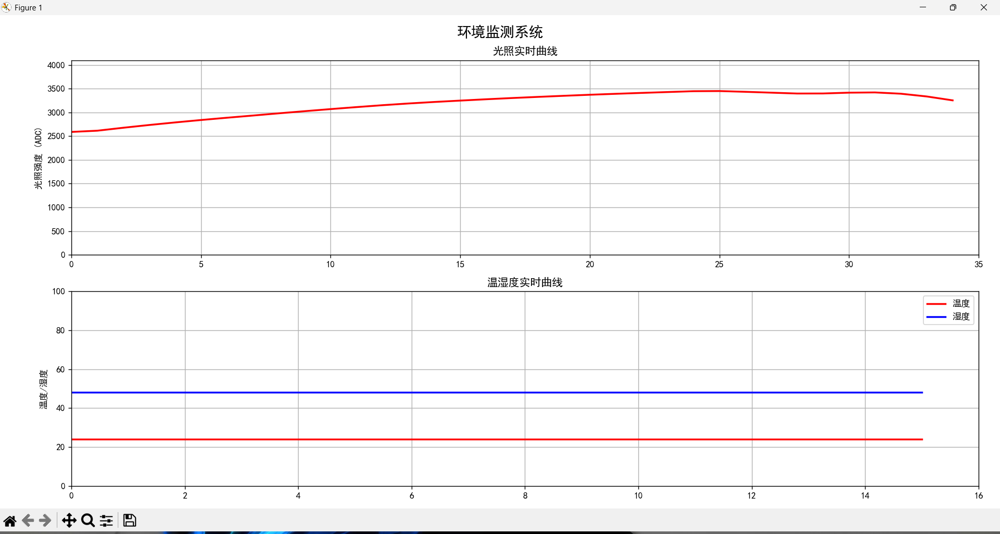

# STM32-Environment-Monitor

基于 STM32F103C8T6 的环境监测系统，采集光照、温湿度数据，支持 OLED 显示、按键调节报警阈值、串口上报、Python 实时曲线图。

## 功能清单

### 下位机（STM32）
- [x] 光照采集（光敏电阻 + ADC，软件滤波）
- [x] 温湿度采集（DHT11，单总线协议）
- [x] OLED 显示（0.96寸 I2C，分页自动轮播）
- [x] 按键交互（PB1/PB11 调节光照报警阈值）
- [x] 声光报警（LED 快闪 + 蜂鸣器）
- [x] 掉电存储（阈值保存在内部 Flash，断电不丢失）
- [x] 独立看门狗（程序卡死自动复位）

### 上位机（Python）
- [x] 串口数据实时接收与解析
- [x] 光照强度实时曲线（绿色正常 / 红色报警）
- [x] 温度、湿度实时曲线
- [x] 自动查找串口，无需手动配置

## 硬件接线


| 模块 | STM32 引脚 | 说明 |
|------|-----------|------|
| 光敏传感器 AO | PA0 | 模拟输入 |
| DHT11 DATA | PA6 | 单总线，需 4.7kΩ 上拉 |
| OLED SCL | PB8 | I2C 时钟 |
| OLED SDA | PB9 | I2C 数据 |
| 蜂鸣器 | PB13 | 低电平触发 |
| 按键 PB1 | PB1 | 增加阈值 |
| 按键 PB11 | PB11 | 减少阈值 |
| LED | PC13 | 报警/心跳指示 |
| 串口 TX | PA9 | 接 USB转TTL 的 **RX** |
| 串口 RX | PA10 | 接 USB转TTL 的 **TX** |

> DHT11 的 DATA 引脚需要 4.7kΩ 上拉电阻

## 软件架构
```text
Hardware/       # 硬件驱动层（ADC、DHT11、OLED、按键等）
System/         # 业务逻辑层（报警、显示、阈值管理）
user/           # 应用层（main.c、System.c）
PC_Tool/        # Python 上位机
``` 

text
### 正常状态（光照充足，曲线绿色）


### 报警状态（手遮光，曲线变红）


*运行 Python 程序后，实时显示光照和温湿度曲线，光照超过阈值时曲线变红*

## 演示视频

点击观看：[STM32环境监测系统 - 实机演示](https://www.bilibili.com/video/BV18W7D66EQe/)

## 串口数据示例

```text
Light:1850  Pct:65%  MAX:2500  MIN:200  T:25C  H:60%  Status:NORMAL
Light:2650  Pct:31%  MAX:2500  MIN:200  T:25C  H:60%  Status:ALARM
Light restored.
```

text

## 技术栈

- **主控**：STM32F103C8T6
- **传感器**：光敏电阻、DHT11
- **显示**：0.96寸 OLED（I2C）
- **嵌入式**：C语言、ADC、I2C、单总线、Flash
- **上位机**：Python + PySerial + Matplotlib

## 作者

[李宜万]  
[应急管理大学/物联网工程] | [2023]  
[https://github.com/xiaozhuzhu322/STM32-Environment-Monitor] | [1753838148@qq.com]
